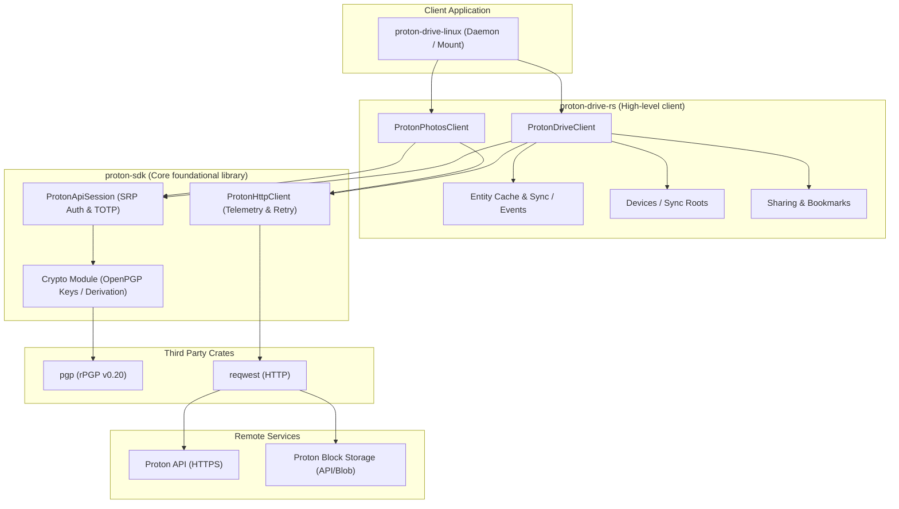
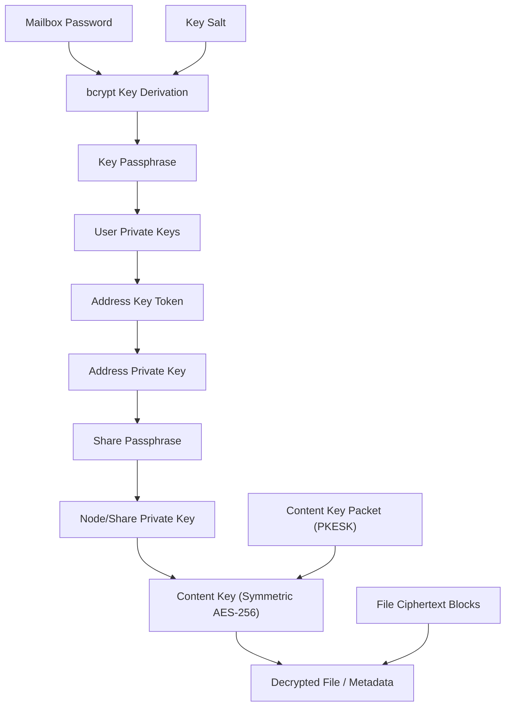
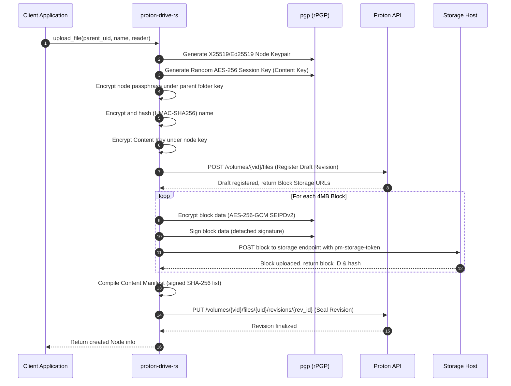
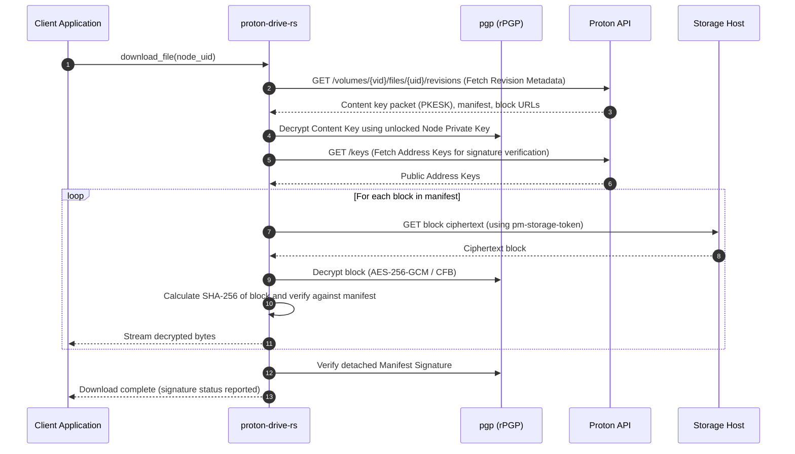

# proton-sdk-rs

[](https://github.com/narrrl/proton-sdk-rs/actions/workflows/ci.yml)
[](https://crates.io/crates/proton-sdk)
[](https://crates.io/crates/proton-drive-rs)
[](https://opensource.org/licenses/MIT)
[](https://github.com/narrrl/proton-sdk-rs)
[](https://deps.rs/repo/github/narrrl/proton-sdk-rs)
[](https://github.com/narrrl/proton-sdk-rs)

A pure-Rust reimplementation of the [Proton Drive SDK](https://github.com/ProtonDriveApps/sdk).

This repository contains a set of crates that replicate the functionality of the official Proton SDKs. Rather than relying on FFI bindings to the official C# NativeAOT core, `proton-sdk-rs` is a **pure-Rust** implementation. It communicates directly with the Proton Drive API over HTTPS, performs all OpenPGP cryptographic operations natively using the [`pgp` (rPGP)](https://crates.io/crates/pgp) crate, and provides an async, developer-friendly interface.

> [!NOTE]
> This is an unofficial, third-party project and is not affiliated with or endorsed by Proton.
> Applications building on top of this SDK must adhere to the operational guidelines of the upstream SDK (such as setting an honest `x-pm-appversion` header, using event-based sync, and avoiding Proton branding). Detailed requirements are documented in the upstream `sdk/README.md` (which can be found in the [sdk/](file:///home/narl/dev/private/proton-sdk-rs/sdk) submodule checkout).

---

## Proven in Action

This SDK is the core engine powering real-world projects:
* **[proton-drive-linux](https://github.com/narrrl/proton-drive-linux)**: A well-working native client and daemon for mounting (via FUSE) and syncing Proton Drive on Linux systems, utilizing both crates provided by this repository.

---

## Workspace Structure

The workspace is divided into two crates, mirroring the separation of concerns in the upstream C# codebase:

| Crate | Version | Docs | Analogue | Description | Key Modules / Entrypoint |
| --- | --- | --- | --- | --- | --- |
| [**`crates/proton-sdk`**](file:///home/narl/dev/private/proton-sdk-rs/crates/proton-sdk) | [](https://crates.io/crates/proton-sdk) | [](https://docs.rs/proton-sdk) | `Proton.Sdk` | Foundational account, session, HTTP client, and OpenPGP cryptography. | [`ProtonApiSession`](file:///home/narl/dev/private/proton-sdk-rs/crates/proton-sdk/src/session.rs) |
| [**`crates/proton-drive-rs`**](file:///home/narl/dev/private/proton-sdk-rs/crates/proton-drive-rs) | [](https://crates.io/crates/proton-drive-rs) | [](https://docs.rs/proton-drive-rs) | `Proton.Drive.Sdk` | High-level Drive & Photos client operations, folders/links management, uploads/downloads, events, caching. | [`ProtonDriveClient`](file:///home/narl/dev/private/proton-sdk-rs/crates/proton-drive-rs/src/client.rs), [`ProtonPhotosClient`](file:///home/narl/dev/private/proton-sdk-rs/crates/proton-drive-rs/src/photos.rs) |

OpenPGP features are powered by rPGP (version `0.20`), and HTTP requests are built on `reqwest`.

---

## System Architecture

The following diagram illustrates how the crates interact with third-party libraries and the Proton API backend:



---

## Deep Dive: Cryptographic Implementation

Proton Drive relies on client-side zero-knowledge encryption. The security architecture is built on a layered key model.

### 1. Layered Key Hierarchy

To perform any read or write operation, you must supply the user's **mailbox (data) password** in addition to the API session tokens. Decryption cascades as follows:



1. **Passphrase Derivation**: The user's mailbox password is derived into a key passphrase via `bcrypt` using salts fetched from the API. See [derive.rs](file:///home/narl/dev/private/proton-sdk-rs/crates/proton-sdk/src/crypto/derive.rs).
2. **User & Address Keys**: The key passphrase unlocks the primary user keys. These keys are used to decrypt the tokens representing the user's address keys. Once unlocked, the address keys allow verification of signatures and unlocking of share keys. See [keys.rs](file:///home/narl/dev/private/proton-sdk-rs/crates/proton-sdk/src/crypto/keys.rs).
3. **Share & Node Keys**: Nodes (files and folders) belong to shares. A share's passphrase is decrypted by the address key. The decrypted share passphrase is used to unlock the node's private key (usually X25519/Ed25519 or legacy RSA).
4. **File Content Keys**: Files contain metadata and data blocks. The file's name and passphrase are encrypted. The symmetric **Content Key** (AES-256) is encapsulated in a PGP Public-Key Encrypted Session-Key (PKESK) packet addressed to the node key. See [content.rs](file:///home/narl/dev/private/proton-sdk-rs/crates/proton-sdk/src/crypto/content.rs).

### 2. Upload Pipeline

When uploading a file:



1. **Generate Node & Content Keys**: The client generates a fresh node keypair (Ed25519/X25519) and a random AES-256 content key.
2. **Prepare Draft**:
   - The node passphrase is encrypted under the parent folder's key.
   - The file name is encrypted and hashed (HMAC-SHA256) under the parent's keys.
   - The content key packet is generated by encrypting the content key to the file's node key.
   - A draft revision is registered via `POST v2/volumes/{vid}/files`.
3. **Upload Blocks**:
   - Files are split into blocks (typically 4 MiB).
   - Each block is encrypted into a PGP SEIPD packet (either SEIPDv1 or SEIPDv2/AEAD).
   - A detached plaintext signature is generated for the block and encrypted to the file's node key.
   - The encrypted block is POSTed to the storage endpoint.
4. **Seal Revision**:
   - Once all blocks are uploaded, the client compiles the Content Manifest (concatenated SHA-256 block hashes + encrypted XAttr metadata block).
   - The manifest is signed using the address key (`ManifestSignature`).
   - The revision is closed and finalized using a `PUT` request. See [client.rs](file:///home/narl/dev/private/proton-sdk-rs/crates/proton-drive-rs/src/client.rs) for the upload orchestration logic.

### 3. Download Pipeline

When streaming a file download via `download_file` or `download_file_to`:



1. **Resolve and Decrypt Content Key**: The PKESK packet `ContentKeyPacket` is retrieved from the node metadata and decrypted using the unlocked node private key, yielding the `ContentKey` (the symmetric session key).
2. **Retrieve Block List**: The client requests the active revision block list. Each block is represented by an absolute URL (`BareURL`) and requires a one-time `pm-storage-token` header (bearer auth is not sent to block storage hosts).
3. **Stream & Decrypt Blocks**:
   - The block's ciphertext is downloaded.
   - For **legacy files** (SEIPDv1): The ciphertext is decrypted using the content key in AES-256-CFB mode with MDC verification.
   - For **AEAD files** (SEIPDv2): The ciphertext is decrypted using the content key in AES-256-GCM mode with 128 KiB chunk sizes.
4. **Integrity & Signature Verification**:
   - The client computes the SHA-256 hash of each ciphertext block and compares it against the digests specified in the file's **Content Manifest**.
   - The manifest's signature (`ManifestSignature`) is verified. The public keys for verification are resolved dynamically from the author's address (via `core/v4/keys/all`).
   - Signature verification is non-fatal: a verification failure yields a [`VerificationStatus`](file:///home/narl/dev/private/proton-sdk-rs/crates/proton-sdk/src/crypto/verify.rs) but does not block read access. See [verify.rs](file:///home/narl/dev/private/proton-sdk-rs/crates/proton-sdk/src/crypto/verify.rs).

### 4. Same-Volume Move Cryptography

Moving a file or folder within the same volume is an offline cryptographic operation that avoids re-uploading file data.
- **Passphrase Rewrapping**: The node's passphrase must be re-encrypted from the source parent's key to the destination parent's key. `proton-sdk-rs` performs this by decrypting the passphrase session key and re-encrypting it ([`rewrap_message_to`](file:///home/narl/dev/private/proton-sdk-rs/crates/proton-sdk/src/crypto/content.rs)), creating a new detached `NodePassphraseSignature`. See [content.rs](file:///home/narl/dev/private/proton-sdk-rs/crates/proton-sdk/src/crypto/content.rs).
- **Metadata Update**: The file name is re-encrypted under the destination's name key, and the name's search hash is recalculated under the destination's hash key. These are submitted via the batch move endpoint.

---

## Current Feature & Parity Status

`proton-sdk-rs` implements **Milestone 2 (Authenticated Read/Write)** and advanced desktop features. Parity with the official C# SDK (pinned at the upstream commit documented in [UPSTREAM_SYNC.md](file:///home/narl/dev/private/proton-sdk-rs/UPSTREAM_SYNC.md)) is actively maintained.

### Feature Matrix

| Module | Feature | Status | Notes / Upstream Parity |
| :--- | :--- | :---: | :--- |
| **Session** | SRP-6a Login | ✅ | Password-based authentication via `begin` / SRP-6a proofs. |
| | TOTP 2FA | ✅ | Support for applying second-factor TOTP codes. |
| | Token Refresh | ✅ | Scope refresh and transparent 401 token refresh. |
| | Resume Session | ✅ | Restore clients instantly via serialized tokens. |
| **HTTP Client** | Retries & Jitter | ✅ | Exponential backoff for 408, 429, and 5xx, respecting `Retry-After`. |
| | Telemetry | ✅ | Pluggable request tracking (`ITelemetry` analogue). |
| **Drive / Volume** | Volume Resolution | ✅ | Auto-resolves volume lists; auto-creates the `my-files` root volume on first login. |
| | Node Listing | ✅ | `get_node`, `enumerate_folder_children`, `enumerate_trash` with key resolution. |
| | File Operations | ✅ | Rename, trash, restore, delete, empty trash. |
| | Move Operations | ✅ | Same-volume move. Batch moves are chunked automatically. |
| | Cross-volume Move | ❌ | Not supported (throwing `NotImplementedException` in the C# public API too). |
| **Uploads** | Block Uploading | ✅ | Encrypts and uploads chunks (4 MiB default) to block storage. |
| | Streaming Upload | ✅ | Streams uploads from any type implementing `std::io::Read`. |
| | Revision Control | ✅ | Create drafts, upload blocks, and seal new file revisions. |
| | AEAD Block Support | ✅ | SEIPDv2 / AES-256-GCM AEAD encryption alongside legacy SEIPDv1 (AES-256-CFB). |
| | Inline Thumbnails | ✅ | Generates and encrypts inline-signed thumbnails. |
| **Downloads** | Block Downloading | ✅ | Streams block retrieval, decryption, and signature checks. |
| | Content Integrity | ✅ | Verification of file manifests and block-level SHA-256 digests. |
| | Signature Verification | ✅ | Detached signature verification (non-fatal, reports status). |
| **Devices** | Device Registration | ✅ | Create and register desktop/sync clients (`create_device`). |
| | Device Listing | ✅ | List registered devices and their sync root folders (`enumerate_devices`). |
| | Device Operations | ✅ | Rename and delete registered devices. |
| **Sharing & Links** | Member Management | ✅ | Invite users (`invite_users`), list members, update roles, and remove members. |
| | Public Share Links | ✅ | Create public shareable links (`create_public_link`) with password protection and expiry. |
| | External Invites | ✅ | Invite non-Proton users (`invite_external_users`) and track registration status. |
| | Bookmarks | ✅ | Save and list public link bookmarks (`create_bookmark`, `list_bookmarks`). |
| | Incoming Invites | ✅ | List, accept, or reject invitations shared *with* the current user. |
| **Photos** | Photos Timeline | ✅ | `ProtonPhotosClient` maps photostream, timeline enumeration, and photo downloads. |
| | Photo Uploads | ✅ | Uploading photos with `PhotoUploadMetadata` (capture time, tags, grouping). |
| | Albums (read) | ✅ | List albums (`enumerate_album_node_uids`) and their photos (`enumerate_album`); album nodes carry `Node::album`. |
| | Photo Tags | ✅ | Add/remove classification tags (`update_photos`); `Favorite` on photos in our own timeline. |
| | Shared Photos | ✅ | Photos/albums shared *with* us (`enumerate_shared_with_me_node_uids`, `enumerate_shared_with_me_album_uids`). |
| | Favorite Shared Photos | ❌ | Needs the photo re-encrypted for our timeline root; not ported. |
| | Album Writes | ❌ | Creating albums and adding/removing photos is not ported. |
| | Photos Volume Create| ❌ | Volume creation is not yet ported. |
| **Caching** | Pluggable Cache | ✅ | Pluggable entity cache (`with_entity_cache`); keys/secrets remain strictly in memory. |

---

## Usage Example

The following code illustrates:
1. Resuming a saved session (`ProtonApiSession::resume`).
2. Initializing the [`ProtonDriveClient`](file:///home/narl/dev/private/proton-sdk-rs/crates/proton-drive-rs/src/client.rs).
3. Querying the `My Files` root and listing immediate folder children.
4. Uploading a small file stream.

```rust,no_run
use std::io::Cursor;
use proton_sdk::config::ProtonClientConfiguration;
use proton_sdk::session::{PasswordMode, ProtonApiSession, ResumeParameters};
use proton_drive_rs::ProtonDriveClient;

#[tokio::main]
async fn main() -> proton_sdk::error::Result<()> {
    // 1. Configure client with honest identification
    let config = ProtonClientConfiguration::new("external-drive-myapp@0.1.0-alpha");

    // 2. Resume a previously stored session
    // (In production, save these credentials securely after SRP login)
    let session = ProtonApiSession::resume(config, ResumeParameters {
        session_id: "session-uid-from-login".into(),
        username: "user@proton.me".into(),
        user_id: "user-id-from-login".into(),
        access_token: "current-access-token".into(),
        refresh_token: "current-refresh-token".into(),
        scopes: vec![],
        is_waiting_for_second_factor_code: false,
        password_mode: PasswordMode::Single,
    })?;

    // 3. Initialize Drive Client with user's mailbox password
    let mailbox_password = b"my-mailbox-password".to_vec();
    let drive = ProtonDriveClient::new(&session, mailbox_password);

    // 4. Resolve the My Files root folder
    let root = drive.get_my_files_folder().await?;
    println!("Root folder resolved. UID: {}", root.uid);

    // 5. Enumerate and print immediate children
    let child_uids = drive.enumerate_folder_children_node_uids(&root.uid).await?;
    let children = drive.enumerate_nodes(&child_uids).await?;
    for child in children {
        println!("Node: {} | Type: {:?}", child.name, child.kind);
    }

    // 6. Upload a new file from a memory stream
    let file_content = b"Hello, Proton Drive from pure Rust!";
    let file_size = file_content.len() as u64;
    let mut reader = Cursor::new(file_content);

    let new_node = drive.upload_file_from(
        &root.uid,
        "hello_rust.txt",
        file_size,
        &mut reader,
    ).await?;
    println!("Successfully uploaded: {} (UID: {})", new_node.name, new_node.uid);

    Ok(())
}
```

### Live Smoke Test & SRP Login

If you need to perform an SRP password login and TOTP authentication, check out the live smoke test example at [live_login.rs](file:///home/narl/dev/private/proton-sdk-rs/crates/proton-drive-rs/examples/live_login.rs):

```bash
PROTON_TOTP_SECRET=your_base32_secret cargo run -p proton-drive-rs --example live_login
```

---

## Development & Testing

### Building

Ensure you have a modern Rust toolchain installed (edition 2024, tested on Rust 1.96+).

```bash
cargo build
```

### Running Tests

Unit tests verify the offline SRP math, key derivation, and block cryptosystems:

```bash
cargo test
```

### Live Integration Tests

The live test suite runs read, write, upload, download, and event sync flows against a real Proton account. These tests are ignored by default. To run them, create a `.env` file at the root containing:

```env
username=your_test_user@proton.me
password=your_mailbox_password
```

Then run:

```bash
# Run tests sequentially using a single thread (to prevent TOTP overlap and anti-abuse limits)
PROTON_TOTP_SECRET=your_base32_totp_secret cargo test -p proton-drive-rs --test 'live_*' -- --ignored --nocapture --test-threads=1
```

---

## Upstream Synchronization

We maintain active parity with the official C# SDK codebase. Commit triage and history synchronization records are documented in [UPSTREAM_SYNC.md](file:///home/narl/dev/private/proton-sdk-rs/UPSTREAM_SYNC.md).

---

## License

This project is licensed under the MIT License, matching the license of the upstream SDK. See [LICENSE](file:///home/narl/dev/private/proton-sdk-rs/LICENSE) for details. Use of Proton's hosted services remains subject to Proton's terms of service.
